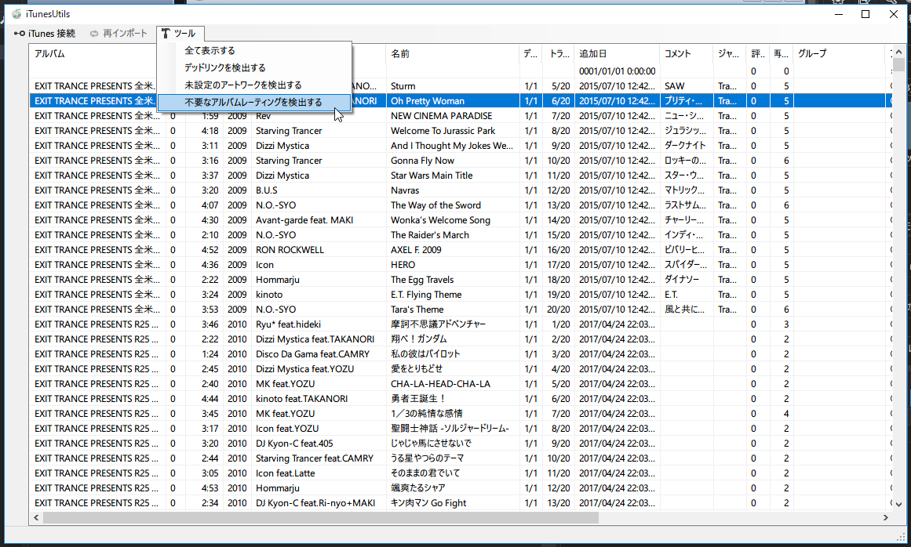

# iTunesUtility

  

iTunesのメンテツール。

## 使い方

初回起動時はiTunesライブラリを自動でインポートします。  
インポート結果はexeと同じ階層に「iTunes Library.json」が作られキャッシュとして機能します。  
iTunesライブラリに変更が加わった場合、再インポートを実行するかファイルを消すことで最新の状態をインポートすることができます。  

準備ができたらリストにトラックが表示されます。  
次にメンテしたい内容のフィルターを選びます。

- デッドリンクを検出する
- 未設定のアートワークを検出する
- 不要なアルバムレーティングを検出する

フィルターを選ぶと内容に合ったトラック情報がリストに表示されます。
トラックに対して行える操作は以下があります。
- 曲の情報をiTunesから読み込む
  - 指定したトラックのみ再インポートを行います
- iTunesからこの曲を削除する
  - iTunesでの「ライブラリから削除」と同様の操作を行います
- アルバムレーティングを1に設定する
  - アルバム全体に設定することでiTunesの自動計算が無いようにできます
- ファイルを選択してアルバムアートを設定する

tips
トラックをダブルクリックするとiTunesで再生を行います。
